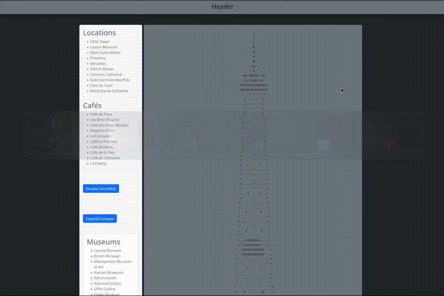

# stick-n-roll

[](./LICENSE)
[](https://www.npmjs.com/package/stick-n-roll)

**`stick-n-roll`** is a lightweight and user-friendly npm package that enables HTML elements to have functionality similar to position: sticky, with the added ability to scroll the block.

## [Demo](https://devashtar.github.io/stick-n-roll/) 👈



## Table of contents

- [Installation](#installation-️)
- [API Reference](#api-reference-️)
- [Example Usage](#example-usage-)
- [Copyright and license](#copyright-and-license)

---

## Installation 🛠️

```sh
npm install stick-n-roll
```

---

## API Reference ⚙️

### Constructor

```ts
new StickNRoll(
  container: HTMLElement,
  containerInner: HTMLElement,
  options?: StickNRollOptions
)
```

Creates a new `StickNRoll` instance and binds scroll behavior to the provided elements.

### Parameters

| Name             | Type                | Description                                                                                                                                                         |
| ---------------- | ------------------- | ------------------------------------------------------------------------------------------------------------------------------------------------------------------- |
| `container`      | `HTMLElement`       | Parent element that defines the sticky boundaries.<br/>Must have a **fixed width** so the inner element can inherit it.<br/>Do not apply **padding** (CSS property) |
| `containerInner` | `HTMLElement`       | Child element that becomes sticky while scrolling.<br/>Do not apply **margin** (CSS property)                                                                       |
| `options`        | `object` (optional) | Optional configuration options.                                                                                                                                     |

> See: [padding](https://developer.mozilla.org/en-US/docs/Web/CSS/padding), [margin](https://developer.mozilla.org/en-US/docs/Web/CSS/margin) and [width](https://developer.mozilla.org/en-US/docs/Web/CSS/Reference/Properties/width).

---

### Options

| Option        | Type                | Default     | Description                                                    |
| ------------- | ------------------- | ----------- | -------------------------------------------------------------- |
| `spaceTop`    | `number` (optional) | `0`         | Offset from the top boundary in pixels.                        |
| `spaceBottom` | `number` (optional) | `0`         | Offset from the bottom boundary in pixels.                     |
| `position`    | `string` (optional) | `"initial"` | CSS `position` value applied when sticky behavior is disabled. |

> See: [position](https://developer.mozilla.org/en-US/docs/Web/CSS/position) and [pixels](https://developer.mozilla.org/en-US/docs/Web/CSS/Reference/Values/length#px)

---

## Methods

### `enable()`

Activates sticky behavior and starts listening to scroll events.

```js
sticky.enable();
```

---

### `disable()`

Disables sticky behavior and restores the original layout.

```js
sticky.disable();
```

---

### `updateSpaces(options?)`

Updates spacing offsets at runtime.

```js
sticky.updateSpaces({ spaceTop: 24, spaceBottom: 32 });
```

#### Parameters

| Option        | Type                | Description                  |
| ------------- | ------------------- | ---------------------------- |
| `spaceTop`    | `number` (optional) | New top offset in pixels.    |
| `spaceBottom` | `number` (optional) | New bottom offset in pixels. |

---

## Example Usage 💻

### HTML JavaScript

```html
<body>
  <h1>Example</h1>
  <main>
    <aside id="container">
      <div id="container_inner">Sidebar content...</div>
    </aside>
    <section>...</section>
  </main>
  <script type="module">
    import StickNRoll from 'stick-n-roll';
    const stickNRoll = new StickNRoll(
      document.getElementById('container'),
      document.getElementById('container_inner'),
      { spaceBottom: 8, spaceTop: 64 },
    );
    stickNRoll.enable();
    // stickNRoll.updateSpaces({ spaceTop: 96, spaceBottom: 16, }); // Change spaces dynamically
    // stickNRoll.disable(); // disables listeners, resets styles, and stops running. To order start again stickNRoll.enable().
  </script>
</body>
```

### React Typescript Tailwind

```ts
import React from 'react';
import StickNRoll from 'stick-n-roll';
// See https://tailwindcss.com/docs/ (version 4.1) to style elements with utility classes

export const App: React.FunctionComponent = () => {
  return (
    <>
      <header
        className="sticky top-0 text-center bg-gray-500 z-1 max-h-14 h-14 p-2 shadow-lg"
        style={{ height: 64 }}
      >
        Header content
      </header>

      <main className="my-12 max-w-7xl w-full mx-auto grid grid-cols-12">
        <StickNRollContainer>
          <TextContent count={10} />
        </StickNRollContainer>

        <div className="col-span-9 p-3 border rounded bg-gray-500">
          <TextContent count={50} />
        </div>
      </main>

      <footer className="min-h-96 text-center bg-gray-500">Footer Content</footer>
    </>
  );
};

const TextContent: React.FC<{ count: number }> = ({ count }) => {
  return Array(count)
    .fill(null)
    .map((_, idx) => (
      <p
        key={idx}
        className="py-2 text-gray-800"
      >
        <b>{idx}.</b> Lorem ipsum dolor sit amet consectetur, adipisicing elit. Perferendis delectus dicta eligendi
        beatae qui laborum consequatur, ipsam fuga expedita esse ex provident et saepe sit incidunt soluta nulla
        accusamus dolor?
      </p>
    ));
};

const StickNRollContainer: React.FunctionComponent<React.PropsWithChildren> = ({ children }) => {
  const stickNRoll = React.useRef<StickNRoll>(null);

  const refCallback = React.useCallback((node: HTMLDivElement) => {
    if (node) {
      stickNRoll.current = new StickNRoll(node.parentElement!, node, { spaceBottom: 8, spaceTop: 64 });
    }
  }, []);

  React.useEffect(() => {
    if (stickNRoll.current) {
      stickNRoll.current.enable();

      return () => {
        stickNRoll.current?.disable();
      };
    }
  }, []);

  return (
    <aside className="col-span-3 me-3">
      <div ref={refCallback} className="rounded bg-blue-200 p-4">
        {children}
      </div>
    </aside>
  );
};
```

---

## Links

- [DOM](https://developer.mozilla.org/en-US/docs/Glossary/DOM)
- [HTMLElement](https://developer.mozilla.org/en-US/docs/Web/API/HTMLElement)
- [dimensions of elements](https://developer.mozilla.org/en-US/docs/Web/API/CSS_Object_Model/Determining_the_dimensions_of_elements)
- [coordinate systems](https://developer.mozilla.org/en-US/docs/Web/CSS/CSSOM_view/Coordinate_systems)
- [viewport](https://developer.mozilla.org/en-US/docs/Glossary/Viewport)
- [position](https://developer.mozilla.org/en-US/docs/Web/CSS/position)
- [this](https://developer.mozilla.org/en-US/docs/Web/JavaScript/Reference/Operators/this)
- [requestAnimationFrame](https://developer.mozilla.org/en-US/docs/Web/API/Window/requestAnimationFrame)
- [resizeObserver](https://developer.mozilla.org/en-US/docs/Web/API/ResizeObserver)
- [addEventListener](https://developer.mozilla.org/en-US/docs/Web/API/EventTarget/addEventListener)
- [removeEventListener](https://developer.mozilla.org/en-US/docs/Web/API/EventTarget/removeEventListener)

## Copyright and license

Code copyright 2025-2026 the [author](https://github.com/devashtar). Code released under the [MIT License](./LICENSE).
